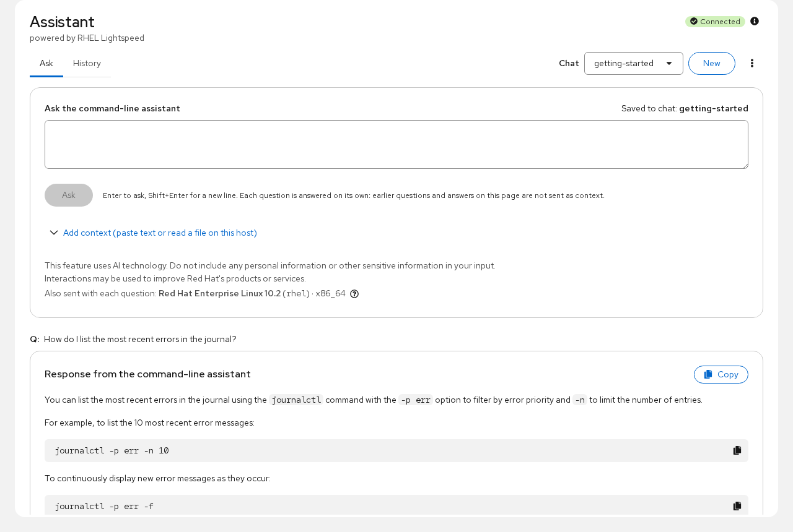
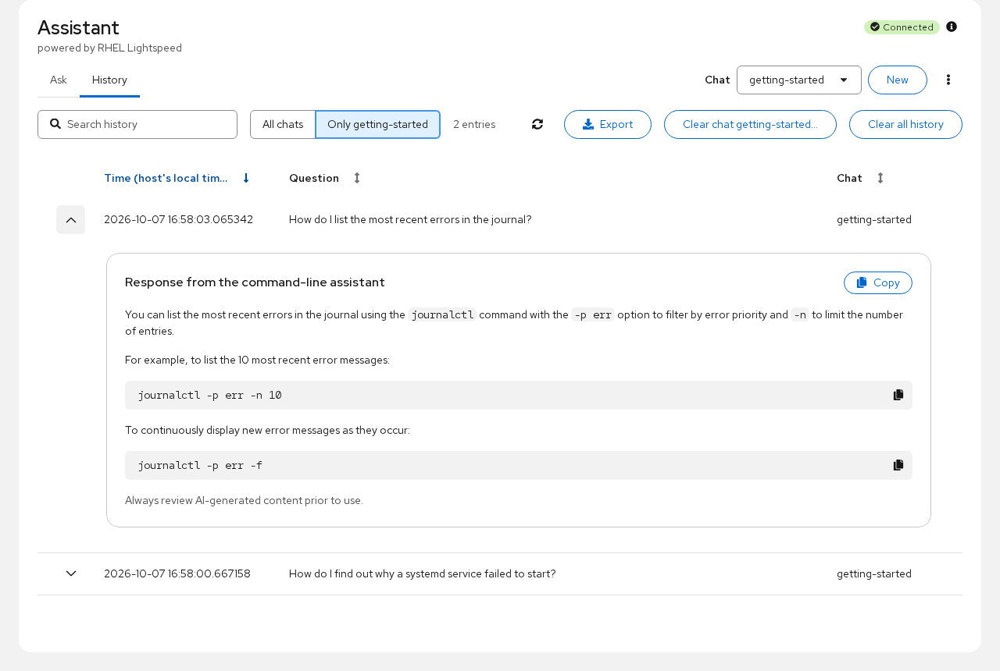
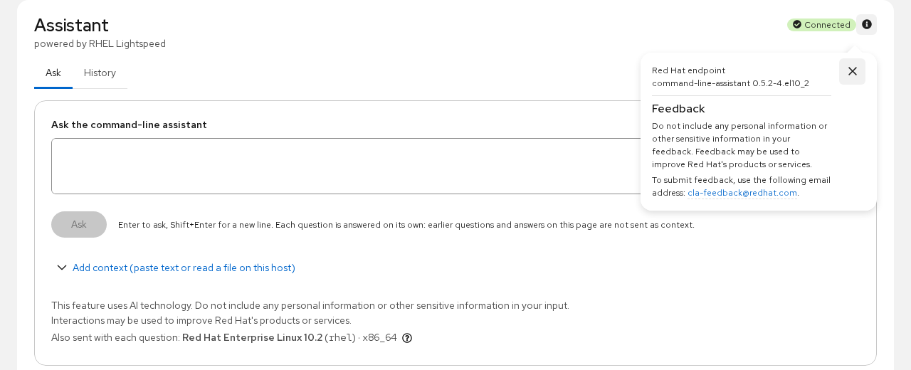

# cockpit-cla

A [Cockpit](https://cockpit-project.org/) module for the RHEL command-line assistant
(the `command-line-assistant` package, the `c` command, powered by RHEL Lightspeed). It appears
in the web console sidebar as **Assistant**, under Tools.

The module talks to the assistant daemon (`clad`) over the system D-Bus, as the logged-in user.
It never runs a shell or the `c` command, and it stores nothing of its own.

## Features

- **Ask** a question, optionally with context: pasted text, or a file read from the host (with
  administrative access, root-only logs such as `/var/log/secure` can be read too). What will be
  sent is always shown before you ask, including the OS identity attached to every question.
- The assistant's 32,000-character limit is enforced before sending: the context is trimmed (you
  choose whether its first or last characters are kept), never the question, and the page says so.
- Answers are shown verbatim as sanitized Markdown, attributed to the assistant, with Copy buttons
  for the whole answer and for each code block. Commands in an answer are never turned into "Run"
  buttons.
- **Named chats**: create, select and delete the chats `clad` keeps for you. The web console uses a
  chat named `cockpit` by default; the `c` command's own `default` chat is shown but never written to
  unless you pick it.
- **History**: every saved question and answer for your account, across chats, with search, a
  per-chat scope, Markdown export of exactly what the table shows, and clearing a chat or everything.
- Clear states for every situation: connected, not installed (with the install command), disabled
  for your account by an administrator, and connection errors with the daemon's own message.
- An **About** popover with the assistant's version, whether it uses a Red Hat or a custom endpoint,
  and the same feedback notice `c feedback` prints.

The assistant answers each question on its own: there is no running conversation. A follow-up
means asking again with the context (and, if useful, the earlier answer), and the page says so.

## Screenshots

| Ask | History | About |
|---|---|---|
|  |  |  |

## Requirements

- RHEL 9 or RHEL 10
- [Cockpit](https://cockpit-project.org/) (`cockpit-bridge`; tested with Cockpit 356)
- `command-line-assistant` **0.4.2 or newer** (tested with 0.4.2-1, 0.5.0-2 and 0.5.2-4), with an
  endpoint the assistant can reach: by default Red Hat's service, which needs the host registered
  with Red Hat

| RHEL release | command-line-assistant | This page |
|---|---|---|
| 9.6 / 10.0 | 0.3.1-x | "Unsupported version", with the upgrade command |
| 9.7 / 10.1 | 0.4.2-1 | Works; no endpoint line in About |
| 9.8 / 10.2 | 0.5.0-2 | Works; no endpoint line in About |
| 9.8 / 10.2, updated | 0.5.2-4 | Works |

On builds before 0.5.2, clad cannot say which endpoint it uses, so About leaves that line out and
the page shows Red Hat's "may be used to improve Red Hat's products or services" sentences, as `c`
of those builds does. DESIGN.md "Supported command-line-assistant versions" has the details.

The module installs without `command-line-assistant` (it is a weak dependency) and then shows how to
install it.

## Installation

Install the RPM for your release (`el9` for RHEL 9, `el10` for RHEL 10):

```bash
sudo dnf install ./cockpit-cla-<version>-1.el10.noarch.rpm
```

Then open the web console (`https://<host>:9090`) and choose **Assistant** under Tools.

### Upgrading from cockpit-cla 1.0.x

Version 2 replaces the earlier plain-JavaScript cockpit-cla 1.0.x under the same package name and
the same URL (`https://<host>:9090/cla`), so installing the new RPM is a plain upgrade
(`sudo dnf install ./cockpit-cla-<version>-1.<dist>.noarch.rpm` or `dnf upgrade`). Questions asked
with 1.0.x went through the `c` command, which saved them in `clad`'s history, so they already
appear on the History tab. The copy 1.0.x kept in the browser's local storage is no longer used.

## Privacy and data

- **Your question goes to the endpoint `clad` is configured for**, together with any context you
  attach and the host's OS name, version, ID and architecture. On a default installation that is
  Red Hat's service; the About popover says whether it is a Red Hat or a custom endpoint. The
  module itself makes no network requests: it only talks to the local daemon.
- **History belongs to `clad`, per Unix user, and is shared with the `c` command.** Questions asked
  here appear in `c history`, and the CLI's history appears here. Clearing all history here also
  clears it for `c`.
- **The module stores nothing**: no files on the host, no settings, no browser storage. Context you
  paste or read is held only in the page until you leave it.
- Do not include personal or other sensitive information in your questions or context.

Problems with the assistant's *answers* go to Red Hat at cla-feedback@redhat.com (what `c feedback`
prints). Problems with this web console page go to this project's
[issue tracker](https://github.com/chipatredhat/cockpit-cla/issues).

## Building from source

```bash
git clone https://github.com/chipatredhat/cockpit-cla.git
cd cockpit-cla
npm install
make              # fetches pkg/lib from the pinned Cockpit commit if missing, then builds dist/
```

Run it from your checkout without installing system files:

```bash
make devel-install     # symlinks dist/ to ~/.local/share/cockpit/cla
make watch             # rebuilds dist/ on save; refresh the browser to pick it up
make devel-uninstall
```

`make rpm` builds an RPM into `rpms/`, and `make dist` the source tarball. The version comes from
`git describe`, so tag the release first (`git tag 2.0.1`) or the package is built as version `1`.

The release tag comes from the build host, so `make rpm` on RHEL 9 gives `.el9`. For the other
RHEL:

```bash
make rpm                      # on a RHEL 10 host: .el10
make rpm DIST=.el10           # on a RHEL 9 host: same package, labelled .el10
make srpm && mock -r centos-stream-10-x86_64 --resultdir=rpms/el10 \
    --rebuild cockpit-cla-*.src.rpm    # built in a real el10 root
```

`DIST=` only relabels; it is honest here because the package is noarch, ships the pre-built bundle,
and nothing in the spec differs between el9 and el10. Use mock when that stops being true.

See [DESIGN.md](DESIGN.md) for the architecture and the reasoning behind each decision,
[TESTING.md](TESTING.md) for the Playwright suite, and [CONTRIBUTING.md](CONTRIBUTING.md) to get
involved.

## Maintainer

Chip Shabazian <chip@redhat.com>. Initial version 2.0 rewrite by Peter Buchan.

## License

LGPL-2.1-or-later, see [LICENSE](LICENSE).
